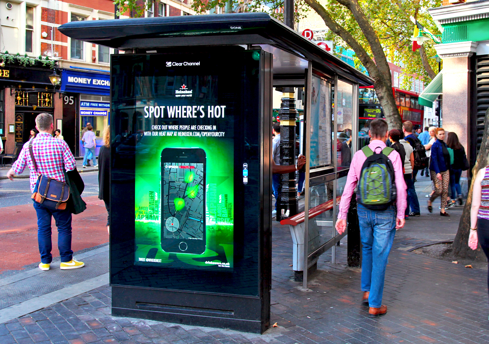

Let's start with the history of OOH (I know nobody likes history, I’ve spiced up a bit though :-)

OOH advertising can trace its lineage back to the earliest civilizations. Thousands of years ago, the Egyptians employed tall stone obelisks to publicize laws and treaties. Fast forward few centuries ….and then in 1450’s there’s a first form of out of home advertising-illustrated posters. Thanks to Johannes Gutenberg for inventing movable type printing press. Measures were taken by the then ‘Marketing Managers’ to increase the exposure of posters. That was the beginning of today’s billion dollar Out Of Home (OOH) advertising industry.

Let’s skip few more centuries-the good- Calculus (for some), Star Wars, Albert Einstein, Space exploration and the bad associated with it-Calculus (for many), Hitler, Green Lantern (pardon me, if you are a GL fan).

And Today?

Companies are now switching out older static network with digital media. Digital Out Of Home is taking over its OOH grand-daddy. 

Who wouldn’t take a peek at large billboards with compelling content?
Simple and clear content, attention grabbing visuals, no motion to slow motion videos-classic rules followed by content managers for successful campaigns.
At Xwards-we call it the ‘Sassy,classy and a bit smart-assy’ rule for killing it! The old adage-Content is the king holds true even today.

The Next Generation for DOOH advertising?

Though DOOH advertising is in its nascent stage in India, there are world class start-ups (just like **<a href="https://www.xwards.com/" target="_blank">Xwards</a>**)  poised to venture into global markets? At the core, we believe technology is the key to evolution. If you find any resemblance to Professor Charles Xavier’s quote from X-men-“Mutation is the key to evolution”, no pun intended.

Now let’s wear the Iron man suit and get our hands on tech. Jarvis, now!

Programmatic advertising is the buzz word in DOOH industry these days. The next evolution for DOOH industry is Automatic Transaction Platform. This programmatic advertising platform will be managed via software platform. It helps automate the decision making process of media buying by targeting specific audiences and demographics.

Brands and Marketing managers are now more focused in ROI than ever & Google and Facebook just nailed it. Now it’s time for DOOH companies to follow the suite.

 If you decide to make a move on starting data-driven digital campaign, here’s a chance at helping kick it off with a bang-checkout **<a href="https://www.xwards.com/" target="_blank">www.xwards.com</a>**