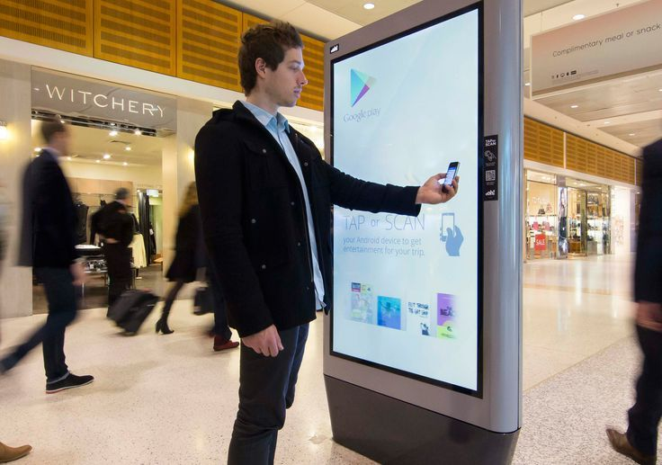

Out-of-Home advertising (OOH) has been around for ages, tracing its origins back to ancient Egyptian civilization. It has evolved over the years, with Digital Out-of-Home advertising (DOOH) being the latest addition to the family. And take it from the Einsteins of advertising, this baby is here to stay!

Marketers have long used used OOH media to reach their audience when they were on the go, and therefore likely to pay attention to the ad, such as in bus shelters, on billboards near traffic signals, etc. But OOH lacked what many other media offered: interactivity and Customer Experience (CX). This is where DOOH comes in. Combining digitization with OOH has allowed marketers to deliver ads that are engaging, interactive in nature, and relevant to the audience, thanks in large part to the advent of facial recognition, geotargeting, Augmented Reality(AR), and data-driven systems.

Lifestyle upgrades along with greater purchasing power has seen DOOH prevail effectively in airports, malls, cabs, elevators, parking lots, hotels, and so on – DOOH is all around us.

Alright, let's dig into some statistics. Boring, huh? Don’t worry, we’ve kept it short.

From the 1990s onwards, Out-of-Home's share of global ad spending has averaged at 6%. Of this, Digital OOH (DOOH) is estimated at one-third (34.8%) of OOH advertising last year. According to the experts at WARC, this figure is expected to rise to 45% by 2021.

USA and UK have been spearheading this shift. An investment of around £100m has ensured a rise in the number of digital screens in the UK from 2,056 in 2009 to over 17,000 in 2017. Developing countries are now picking up on this trend too, with India's digital signage systems market projected to reach $524 million by 2019.

As DOOH is further integrated with the best-in-class ad-tech to reach more and more people, it will become more essential to digital marketing programs.

Need we say more?

If you decide to explore the potential of this technology, make sure you visit **<a href="https://www.xwards.com/" target="_blank">www.xwards.com</a>**!